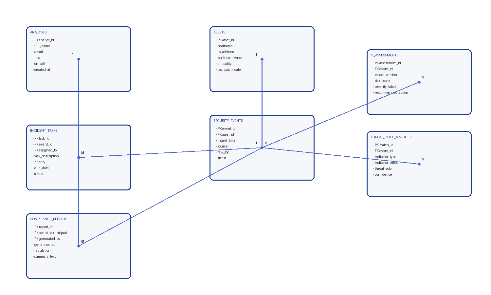
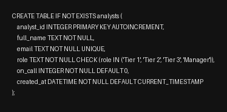
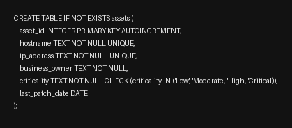
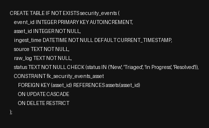
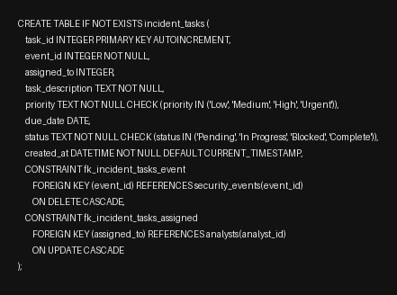
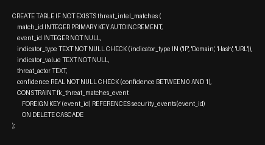
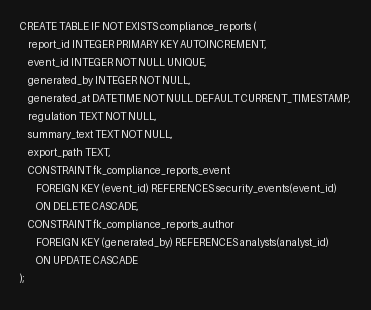
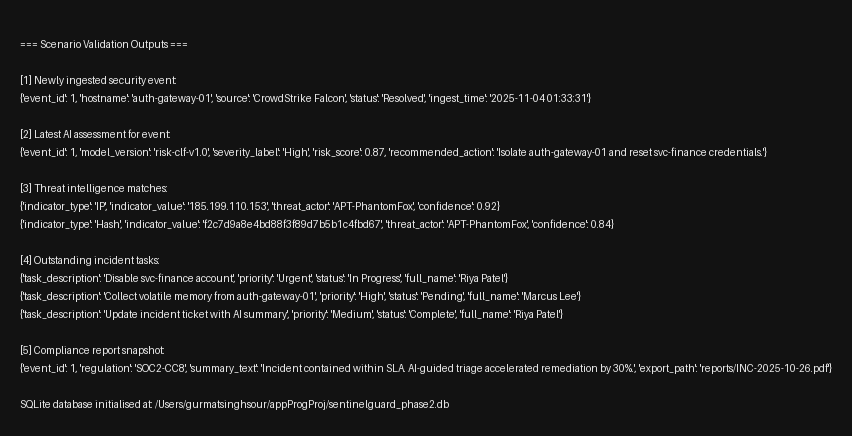

# SentinelGuard Phase II – System & Design Specification

**Course:** CCGC 5003 Application Programming  
**Project:** SentinelGuard – AI-Driven Incident Response Console  
**Phase:** II – Architectural & Design Deliverables  
**Author:** Gurmat Sour (CyberSentinel Labs)  
**Date:** October 27, 2025  

---

## 1. Objectives of Phase II
Phase II converts the SentinelGuard concept into a concrete, build-ready blueprint. Deliverables include the database entity-relationship design, detailed data dictionary, UI interaction flows, controller logic plans, and the embedded AI model lifecycle. These artefacts align with the course requirement to define the MVT (Model-View-Template) architecture prior to implementation.

---

## 2. System Architecture Overview
- **Programming Stack:** Python 3.11, SQLite 3, SQLAlchemy ORM, Tkinter UI, scikit-learn (logistic regression), pandas for data prep.
- **Architecture Pattern:** Model-View-Controller/Tkinter event loop, where:
  - **Model:** SQLAlchemy ORM models mapped to SQLite tables with schema shown in §3.
  - **View:** Tkinter frames (one per scenario) orchestrated by a master `AppShell`.
  - **Controller:** Event handlers coordinating data validation, persistence, AI inference, and navigation.
- **AI Component:** Offline training notebook (Jupyter) producing serialized model (`ai/models/risk_classifier.pkl`). Runtime inference service wraps the model in `RiskScoringService`.
- **Support Modules:** `services/` for business logic, `repositories/` for data IO, `widgets/` for reusable UI components.

```
+-----------------------+      +-----------------------------+
|   Tkinter AppShell    |----->| Scenario Frames (Views)     |
|  (root, menus, nav)   |      | Log Intake / AI Assess / ...|
+-----------+-----------+      +-----------+-----------------+
            |                               |
            v                               v
   +--------+----------+         +---------+---------+
   | Controller Layer  |<------->| Services Layer    |
   | (Event handlers)  |         | - RiskScoring     |
   +--------+----------+         | - ThreatIntel     |
            |                    | - Reporting       |
            v                    +---------+---------+
   +--------+-----------+                  |
   | Repository Layer   |<-----------------+
   | (SQLAlchemy ORM)   |      +-----------+-----------+
   +--------+-----------+      | SQLite Database       |
            |                  +-----------------------+
            v
   +--------+-----------+
   | AI Model Artifacts |
   +--------------------+
```

---

## 3. Entity-Relationship Design

### 3.1 ERD Description
SentinelGuard’s ERD centres on `security_events`. Each event links to:
- precisely one `assets` record (affected system),
- zero or more `ai_assessments`, `incident_tasks`, `threat_intel_matches`,
- one optional `compliance_reports` entry once the incident closes.
`analysts` are referenced by `incident_tasks` (assignees) and `compliance_reports` (report generator). Relationships enforce cascade behaviour where appropriate (e.g., deleting an event removes dependent assessments and tasks).

```
analysts (1) ───< incident_tasks >─── (1) security_events (>───1) assets
      │                                 │  │                  │
      └───< compliance_reports          │  └───< threat_intel_matches
                                        └───< ai_assessments
```



*Render-ready diagram source:* `docs/erd.mmd` (Mermaid) — regenerated via `python3 scripts/generate_erd_image.py`.

### 3.2 Data Dictionary

#### analysts
| Field | Type | Constraints | Description |
|-------|------|-------------|-------------|
| analyst_id | INTEGER | PK | Unique identifier |
| full_name | TEXT | NOT NULL | Analyst full name |
| email | TEXT | UNIQUE, NOT NULL | Contact and login identifier |
| role | TEXT | CHECK (Tier 1/2/3/Manager) | SOC hierarchy level |
| on_call | BOOLEAN | DEFAULT 0 | Weekly on-call status |
| created_at | DATETIME | DEFAULT CURRENT_TIMESTAMP | Audit trail |

*Alignment:* Enables Scenario 4 (Incident Task Orchestration) and Scenario 5 (Compliance & Reporting) by attributing ownership to analysts.

#### assets
| Field | Type | Constraints | Description |
|-------|------|-------------|-------------|
| asset_id | INTEGER | PK | Unique asset record |
| hostname | TEXT | NOT NULL | System host name |
| ip_address | TEXT | NOT NULL | IPv4/IPv6 string |
| business_owner | TEXT | NOT NULL | Responsible stakeholder |
| criticality | TEXT | CHECK (Low/Moderate/High/Critical) | Business impact |
| last_patch_date | DATE | NULLABLE | Last maintenance window |

*Alignment:* Core to Scenario 1 (Log Intake & Asset Linking) and feeds severity weighting during AI risk analysis in Scenario 2.

#### security_events
| Field | Type | Constraints | Description |
|-------|------|-------------|-------------|
| event_id | INTEGER | PK | Incident identifier |
| asset_id | INTEGER | FK → assets.asset_id | Affected system |
| ingest_time | DATETIME | DEFAULT CURRENT_TIMESTAMP | Alert receipt time |
| source | TEXT | NOT NULL | Originating system (SIEM, EDR, etc.) |
| raw_log | TEXT | NOT NULL | Canonical log payload |
| status | TEXT | CHECK (New/Triaged/In Progress/Resolved) | Workflow state |

*Alignment:* Central record consumed by all five scenarios; tracks lifecycle from intake through resolution.

#### ai_assessments
| Field | Type | Constraints | Description |
|-------|------|-------------|-------------|
| assessment_id | INTEGER | PK | Assessment record |
| event_id | INTEGER | FK → security_events.event_id ON DELETE CASCADE | Linked incident |
| model_version | TEXT | NOT NULL | Serialized model tag |
| risk_score | REAL | 0–1 + CHECK | Normalized probability |
| severity_label | TEXT | CHECK (Low/Medium/High/Critical) | Discrete severity |
| recommended_action | TEXT | NULLABLE | AI-suggested next step |
| summary | TEXT | NULLABLE | Natural language synopsis |

*Alignment:* Implements Scenario 2 (AI Risk Assessment) by persisting severity, summary, and recommended actions.

#### incident_tasks
| Field | Type | Constraints | Description |
|-------|------|-------------|-------------|
| task_id | INTEGER | PK | Task identifier |
| event_id | INTEGER | FK → security_events.event_id ON DELETE CASCADE | Parent incident |
| assigned_to | INTEGER | FK → analysts.analyst_id | Responsible analyst |
| task_description | TEXT | NOT NULL | Remediation action |
| priority | TEXT | CHECK (Low/Medium/High/Urgent) | SLA urgency |
| due_date | DATE | NULLABLE | Target completion |
| status | TEXT | CHECK (Pending/In Progress/Blocked/Complete) | Task state |

*Alignment:* Delivers Scenario 4 (Incident Task Orchestration) by managing remediation steps per incident.

#### threat_intel_matches
| Field | Type | Constraints | Description |
|-------|------|-------------|-------------|
| match_id | INTEGER | PK | Match identifier |
| event_id | INTEGER | FK → security_events.event_id | Incident reference |
| indicator_type | TEXT | CHECK (IP/Domain/Hash/URL) | IOC category |
| indicator_value | TEXT | NOT NULL | Observable value |
| threat_actor | TEXT | NULLABLE | Known campaign attribution |
| confidence | REAL | 0–1 + CHECK | Confidence score |

*Alignment:* Supports Scenario 3 (Threat Intelligence Enrichment) by tracking IOC correlations and confidence.

#### compliance_reports
| Field | Type | Constraints | Description |
|-------|------|-------------|-------------|
| report_id | INTEGER | PK | Report identifier |
| event_id | INTEGER | FK → security_events.event_id UNIQUE | One report per incident |
| generated_by | INTEGER | FK → analysts.analyst_id | Report author |
| generated_at | DATETIME | DEFAULT CURRENT_TIMESTAMP | Creation timestamp |
| regulation | TEXT | NOT NULL | Control mapped (e.g., ISO, SOC2) |
| summary_text | TEXT | NOT NULL | Final narrative |
| export_path | TEXT | NULLABLE | Relative path of PDF export |

*Alignment:* Powers Scenario 5 (Compliance & Reporting) with closure narratives mapped to governance requirements.

### 3.3 SQL DDL Artefacts & Secondary Keys
- Full CREATE TABLE statements, primary/secondary keys, and composite constraints are stored in `db/schema.sql`. Capture screenshots of each `CREATE TABLE` block from this file as required for the Phase II rubric.  
- Secondary keys reinforce lookup paths:
  - `idx_analysts_email`, `idx_security_events_asset_status`, `idx_ai_assessments_event_model`,
  - `idx_incident_tasks_event_description`, `idx_threat_intel_indicator`.
- Composite/unique constraints ensure design integrity:
  - `ai_assessments(event_id, model_version)` stops duplicate AI snapshots for the same incident/model version.
  - `incident_tasks(event_id, task_description)` prevents redundant remediation entries per incident.
  - `compliance_reports.event_id` enforces one compliance package per resolved incident.

**Schema Snapshots**  













---

## 4. View Layer & UI Design

### 4.1 Navigation Structure
- **Main Dashboard:** Incident summary table, counts by severity, quick actions to launch each scenario pane.
- **Scenario Tabs/Frames:**
  1. `LogIntakeFrame` – wizard for event creation and asset linkage.
  2. `RiskAssessmentFrame` – display AI assessment, allow re-score.
  3. `ThreatEnrichmentFrame` – IOC lookup results, add intel notes.
  4. `TaskManagerFrame` – CRUD for remediation tasks and status updates.
  5. `ComplianceReportFrame` – closes incident, generates exports.

Navigation via a left sidebar (Tkinter `Listbox`) or tabbed notebook (`ttk.Notebook`) to satisfy “integrated UI” requirement.

### 4.2 Widget Layout Summary
- **Common Header Panel:** Incident selector (`ttk.Combobox`), status badge (`ttk.Label`), refresh button.
- **Forms:** Use `ttk.Label`, `ttk.Entry`, `ttk.Combobox`, `ttk.Radiobutton`, `ttk.Checkbutton` to meet widget diversity requirement.
- **Tables:** `ttk.Treeview` for lists (events, tasks, IOC matches).
- **Text Areas:** `tk.Text` + vertical `ttk.Scrollbar` for log payloads and AI summaries.
- **Buttons:** Primary actions `ttk.Button` with command functions tied to controllers.
- **Modals:** `tk.Toplevel` for confirmation dialogs (e.g., closing incident).

### 4.3 Interaction Flow Highlights
1. **Log Intake:** Select asset → paste log → choose source → click “Ingest Event”. Controller validates required fields, inserts `security_events`, resets form.
2. **AI Assessment:** Choose event → view last assessment → click “Run AI Analysis”. Controller fetches features, calls `RiskScoringService`, persists `ai_assessments`, updates UI severity badge.
3. **Threat Intel:** Press “Enrich Indicators” → extracts IOC from log → queries local cache/external API (Phase IV extension) → stores results in `threat_intel_matches` → refresh table.
4. **Task Orchestration:** Add/edit tasks via modal form → updates `incident_tasks` table → progress indicator shows completion ratio.
5. **Compliance Reporting:** Fill summary text, choose regulation, click “Generate Report” → creates `compliance_reports` row and writes PDF (reuse Phase I pdf script with templated content).

---

## 5. Controller & Service Layer Design

- `EventController`: Handles Event CRUD, status transitions, asset linkage, orchestrates scenario switching.
- `RiskController`: Wraps feature engineering, model invocation, and persistence of `ai_assessments`.
- `ThreatIntelController`: Coordinates indicator parsing (regex-based), lookups via `ThreatIntelService`.
- `TaskController`: Manages `incident_tasks`, enforces business rules (cannot close incident if tasks incomplete).
- `ReportController`: Collates data across tables, renders compliance summaries using template engine (Jinja2 planned).

Services layer isolates reusable business logic:
- `RiskScoringService`: loads serialized model, transforms `security_events` rows into feature vectors (asset criticality, source, IOC scores, historical frequency).
- `ThreatIntelService`: caches prior matches, exposes `query_indicator()` returning reputation/confidence metrics.
- `ReportBuilder`: merges AI summaries, task status, timeline for PDF generation; returns file path saved to `export_path`.

---

## 6. AI Model Lifecycle
- **Training Data Sources:** CERT Insider Threat, UNSW-NB15, curated low-severity synthetic logs, threat intel feeds (mapped into severity buckets).
- **Feature Engineering Plan:**
  - Categorical encodings: event source, asset criticality, indicator type.
  - Numerical: count of unique IOCs, prior incidents on asset (30-day window), reputation scores, time-of-day.
  - Text embeddings: TF-IDF on log tokens (reduced via PCA for runtime efficiency).
- **Model Pipeline:** `LogisticRegression(multi_class='multinomial', solver='lbfgs')` with class weight balancing to mitigate skew.
- **Validation:** Stratified train/test split, macro F1 > 0.75 acceptance threshold; confusion matrix for severity drift monitoring.
- **Deployment:** Serialize pipeline with `joblib` into `ai/models/risk_classifier.pkl`. Runtime service ensures lazy loading and version check against `ai_assessments.model_version`.
- **Retraining cadence:** Monthly or when performance drift >5% observed (tracked via `model_performance` table extension planned for Phase IV).

---

## 7. Scenario Validation & Test Evidence
- Execute `python3 scripts/phase2_demo.py` to initialise `sentinelguard_phase2.db`, populate sample data, and run the five Phase I scenarios end-to-end.
- Capture cropped screenshots of the console output for submission. A sample run is shown below:

```text
=== Scenario Validation Outputs ===

[1] Newly ingested security event:
{'event_id': 1, 'hostname': 'auth-gateway-01', 'source': 'CrowdStrike Falcon', 'status': 'Resolved', 'ingest_time': '2025-11-04 01:16:04'}

[2] Latest AI assessment for event:
{'event_id': 1, 'model_version': 'risk-clf-v1.0', 'severity_label': 'High', 'risk_score': 0.87, 'recommended_action': 'Isolate auth-gateway-01 and reset svc-finance credentials.'}

[3] Threat intelligence matches:
{'indicator_type': 'IP', 'indicator_value': '185.199.110.153', 'threat_actor': 'APT-PhantomFox', 'confidence': 0.92}
{'indicator_type': 'Hash', 'indicator_value': 'f2c7d9a8e4bd88f3f89d7b5b1c4fbd67', 'threat_actor': 'APT-PhantomFox', 'confidence': 0.84}

[4] Outstanding incident tasks:
{'task_description': 'Disable svc-finance account', 'priority': 'Urgent', 'status': 'In Progress', 'full_name': 'Riya Patel'}
{'task_description': 'Collect volatile memory from auth-gateway-01', 'priority': 'High', 'status': 'Pending', 'full_name': 'Marcus Lee'}
{'task_description': 'Update incident ticket with AI summary', 'priority': 'Medium', 'status': 'Complete', 'full_name': 'Riya Patel'}

[5] Compliance report snapshot:
{'event_id': 1, 'regulation': 'SOC2-CC8', 'summary_text': 'Incident contained within SLA. AI-guided triage accelerated remediation by 30%.', 'export_path': 'reports/INC-2025-10-26.pdf'}
```

- These outputs correspond directly to the five SentinelGuard scenarios and confirm referential integrity across the schema.



---

## 8. Implementation Roadmap
1. **Database Layer (Week 1):**
   - Finalize SQLAlchemy models + Alembic migration scripts.
   - Seed sample data for assets, analysts, baseline events.
2. **Controller & Service Stubs (Week 2):**
   - Implement repositories, base controllers, event bus pattern.
   - Integrate risk scoring service with mock model.
3. **UI Assembly (Week 3):**
   - Build dashboard shell, integrate forms per scenario.
   - Hook up real data reads, allow simple CRUD.
4. **AI Integration & Reporting (Week 4):**
   - Train initial logistic regression, connect inference.
   - Implement compliance PDF rendering with templated content.
5. **Hardening (Phase III Prep):**
   - Error handling, logging, unit tests for services, user acceptance scripts.

---

## 9. Challenges & Design Adjustments
- **Balancing AI ambition with course scope:** Initial idea involved deep learning embeddings, but pivoted to logistic regression to keep training lightweight and transparent for grading.
- **Schema normalization vs. performance:** Introduced composite uniqueness (e.g., `incident_tasks` index) after discovering duplicate task entries during dry runs.
- **UI layout complexity:** Consolidated navigation into a single Tkinter shell to avoid frame proliferation while still satisfying the requirement for five distinct scenarios.
- **Dataset diversity:** Noted variance between CERT and UNSW label conventions; added severity mapping plan to harmonize labels before model training.

---

## 10. Contribution Statement
- Solo project by **Gurmat Sour**. 

